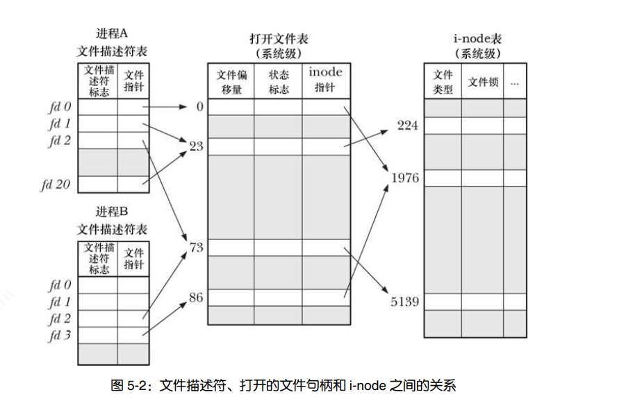
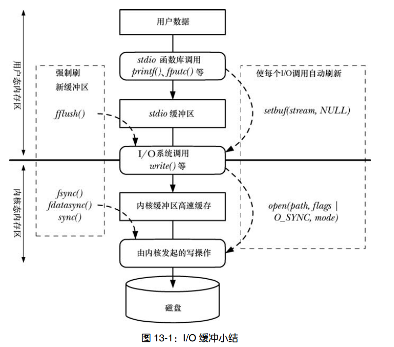

## 2. 通用文件io

### 1. 文件描述符
> 所有执行io操作的系统调用都需要以文件描述符指代打开的文件，(通常为小整数)，文件描述符表示为所有类型已打开文件，针对每个进程，文件描述符各成一套。

| 用途  |  stdio常量   |  posix常量 | 文件描述符 |
|------------|---------|----------------|-----------|
|   标准输入  | stdin   | STDIN_FILENO  |   0 |
|   标准输出  | stdout  | STDOUT_FILENO |   1 |
|   标准错误  | stderr  | STDERR_FILENO |  2  |

### 2. 相关函数
1. **open()**
    ```c
    #include <sys/types.h>
    #include <sys/stat.h>
    #include <fcntl.h>

    int open(const char *pathname, int flags); 
    ```

    `pathname`: 文件路径,若是软连接，则会解引用。

    `flags`:

      1. `O_RDONLY`: 以只读方式打开文件。
      2. `O_WRONLY`: 以只写方式打开文件。
      3. `O_RDWR`:   以只读写方式打开文件。
      4. `O_APPEND`： 追加模式打开文件。
      5. `O_CREAT`: 若文件不存在则创建。
      6. `O_DIRECT`: 无缓冲输出/输入。
      7. `O_CLOEXEC`: 设置close-on-exec标志。
      8. `O_NOFOLLOW`: 对软连接不解引用。
      9. `O_TRUNC`: 截断文件。
      10. `O_NONBLOCK`: 以非阻塞模式打开。
      11. `O_SYNC`: 以同步模式打开。
      12. `O_TRUNC`: 如果文件为普通文件，将清空文件,文件长度为0。
2. **read()**
    ```c
    // read 从文件描述符fd所打开的文件读取count个字节数据到buf指向的内存空间中
    #include <unistd.h>
    ssize_t read(int fd, void *buf, size_t count);
    ```
3. **write**
    ```c
    #include <unistd.h>

    // 从缓冲区buf读取count个字节写入到由文件描述符fd指向的文件
    ssize_t write(int fd, const void *buf, size_t count);
    ```
4. **close**
    ```c
    #include <unistd.h>
    
    // 关闭fd文件描述符
    int close(int fd);
    ```
5. **lseek**
   ```c
    #include <sys/types.h>
    #include <unistd.h>

    // 对于打开的每个文件，内核都会记录其文件偏移量，文件偏移量是指下次read()/write()操作的起始位置。
    // 为文件中或文件结尾后的任一位置。在文件原结尾处之后的某一位置写入数据将导致文件空洞。从文件空洞处读取文件将返回全 0 字节。

    // 报告/设置 read / write 文件偏移量
    off_t lseek(int fd, off_t offset, int whence);
   ```

   `whence`:
     
      1. `SEEK_SET`: 文件偏移量设置 offset 字节。
      2. `SEEK_CUR`: 文件偏移量设置到 当前位置 + offset 字节。
      3. `SEEK_END`: 文件偏移量设置到 文件末尾 + offset 字节。
6. **fcntl**
    ```c
    #include <unistd.h>
    #include <fcntl.h>

    // 操作文件描述符
    int fcntl(int fd, int cmd, ... /* arg */ );
    ```
    `cmd`:
      1. `F_DUPFD`: 复制文件描述符fd,返回最小可用的文件描述符(>=arg)
      2. `F_GETFD / F_SETFD`: 获取/设置文件描述符标志。 
      3. `F_GETFL / F_SETFL`: 获取/设置文件描述符状态标志。 允许更改的标志有`O_APPEND`、`O_NONBLOCK`、`O_NOATIME`、`O_ASYNC` 和 `O_DIRECT`。
      4.  
    ```c
    // 获取文件描述符打开状态标志

    int fd = open("./main.c", O_RDWR);
    if (fd == -1) errExit("open");

    int flags, accessMode;
    flags = fcntl(fd, F_GETFL);
    if (flags == -1) errExit("fcntl F_GETFL");
    accessMode = flags & O_ACCMODE;

    if (accessMode & O_RDONLY) {
        printf("只读\n");
    }
    if (accessMode & O_WRONLY) {
        printf("只写\n");
    }
    if (accessMode & O_RDWR) {
        printf("可读写\n");
    }

    // 为文件描述符追加 O_APPEND 标志
    
    flags |= O_APPEND;
    int  ret =  fcntl(fd, F_SETFL, flags);
    if (ret == -1) errExit("fcntl F_SETFL");
    ```
7. **dup**
   
   ```c
    #include <unistd.h>

    // 复制一个文件描述符
    int dup(int oldfd); // 返回系统未用的最小文件描述符
    int dup2(int oldfd, int newfd); // 复制文件描述符，新fd由newfd指定，若newfd打开，则执行close(fd)关闭
        
    #define _GNU_SOURCE             /* See feature_test_macros(7) */
    #include <fcntl.h>              /* Obtain O_* constant definitions */
    #include <unistd.h>

    // 新参数flags 只支持设置 O_CLOEXEC 参数
    int dup3(int oldfd, int newfd, int flags);
   ```
8. **pread / pwrite**
    ```c
    #include <unistd.h>

    // 在指定偏移量(ooffset)对文件描述符(fd)进行read/write
    // (fd)必须是可定位的(即可对fd执行lseek调用)
    ssize_t pread(int fd, void *buf, size_t count, off_t offset);
    ssize_t pwrite(int fd, const void *buf, size_t count, off_t offset);
    ```

9. **writev / readv**
    ```c
    #include <sys/uio.h>

    // 在多个buf中read/write数据(分散读入 集中输出)
    ssize_t readv(int fd, const struct iovec *iov, int iovcnt);
    ssize_t writev(int fd, const struct iovec *iov, int iovcnt);


    //demo
    #include <stdio.h>
    #include <unistd.h>
    #include <fcntl.h>
    #include <sys/uio.h>
    #include <stdlib.h>


    int errExit(const char* str) {
        perror(str);
        exit(127);
    }
    #define BUFF 100
    #define IOV_LEN 3
    int main(int argc, char *argv[]) {
        struct iovec iovs[3];
        ssize_t rn, wn;
        int fd = open("./5-5.c", O_RDONLY);
        if (fd == -1) errExit("open");

        while (1)
        {   
            char buf1[BUFF] = {0};
            char buf2[BUFF] = {0};
            char buf3[BUFF] = {0};

            iovs[0].iov_base = buf1;
            iovs[0].iov_len = sizeof(char) * BUFF;
            iovs[1].iov_base = buf2;
            iovs[1].iov_len = sizeof(char) * BUFF;
            iovs[2].iov_base = buf3;
            iovs[2].iov_len = sizeof(char) * BUFF;
            
            rn=readv(fd, iovs, IOV_LEN);
            if (rn == -1) errExit("readv");
            if (rn == 0)  {
                break;
            }
            wn = writev(STDOUT_FILENO, iovs, IOV_LEN);
            if ( wn == -1) errExit("writev");
        }
        return 0;
    }
    ```
10. **truncate / ftruncate**
    ```c
        #include <unistd.h>
        #include <sys/types.h>

        // 将文件大小设置为 length 指定的值
        int truncate(const char *path, off_t length);
        int ftruncate(int fd, off_t length);
    ```
11. **mktemp**
    ```c
    #include <stdlib.h>
    
    // 模板参数采用路径名形式，其中最后 6 个字符必须为 XXXXXX。这 6 个字符将被替换，以保证文件名的唯一性，且修改后的字符串将通过 template 参数传回。必须将其指定为字符数组。
    int mkstemp(char *template);
    ```
### 3.
1. 原子操作: 
    
    >将某一系统调用所完成的各个动作作为不可终端的操作，一次性加以执行。其执行期间不会被其他进程中断。

2. 文件描述符,打开的文件句柄和i节点之间的关系
    

3. 大文件io
   >在编译程序时，将宏_FILE_OFFSET_BITS 的值定义为64。 
   
   >向printf() 传递offset值 
    ```c
    #define _FILE_OFFSET_BITS 64
    printf("offset=%lld\n", offset);
    ```

### 4. 文件io缓冲

1. **文件io的内核缓冲-缓冲区高速缓存**
   
   > - read / write 调用在操作磁盘文件时不会对硬盘发起访问，而是在用户空间缓冲区和内核空间换缓冲区复制数据。意在使read/write操作更为迅速，因为他们不需要等待磁盘操作。
   > -  如果与文件发生大量的数据传输，通过采用大块空间（8192或4096）缓冲数据，以及执行更少的系统调用，可以极大地提高 I / O 性能

2. **stdio库的缓冲**
   
    > 当操作磁盘文件时，缓冲大块数据以减少系统调用，C 语言函数库的 I/O 函数（比如，fprintf()、fscanf()、fgets()、fputs()、fputc()、fgetc()）正是这么做的。因此，使用 stdio 库可以使编程者免于自行处理对数据的缓冲，

    > 打开流后，必须在调用任何其他 stdio 函数之前先调用 setvbuf()。setvbuf()调用将影响后续在指定流上进行的所有 stdio 操作

    ```c
    #include <stdio.h>

    void setbuf(FILE *stream, char *buf);

    int setvbuf(FILE *stream, char *buf, int mode, size_t size);
    ```
    `buf`:
      1. 要么将参数 buf 指定为 NULL 以表示无缓冲，要么指向由调用者分配的 BUFSIZ 个字节大小的缓冲区。
    
    `mode`: 

     1. _IONBF:不对 I/O 进行缓冲。每个 stdio 库函数将立即调用 write()或者 read()，并且忽略 buf 和 size参数

     2.  _IOLBF: 采用行缓冲 I/O。指代终端设备的流默认属于这一类型。对于输出流，在输出一个换行符（除非缓冲区已经填满）前将缓冲数据。对于输入流，每次读取一行数据

     3.  _IOFBF: 采用全缓冲 I/O。单次读、写数据（通过 read()或 write()系统调用）的大小与缓冲区相同。指代磁盘的流默认采用此模式
    
    ```c
    #include <stdio.h>

    // 刷新缓冲区 
    // 若参数 stream 为 NULL，则 fflush()将刷新所有的 stdio 缓冲区。
    int fflush(FILE *stream);
    ```

3. **控制文件io的内核缓冲**

   > 采用 O_SYNC 标志（或者频繁调用 fsync()、fdatasync()或 sync()）对性能的影响极大

   ```c
    #include <unistd.h>

    // fsync()系统调用将使缓冲数据和与打开文件描述符 fd 相关的所有元数据都刷新到磁盘上。
    int fsync(int fd);

    int fdatasync(int fd);
  
    // sync()系统调用会使包含更新文件信息的所有内核缓冲区（即数据块、指针块、元数据等）刷新到磁盘上。
    void sync(void);
   ```

4. **混合使用库函数和函数调用进行io**
   ```c
    #include <stdio.h>

    // 打开 FILE *stream 返回一个文件描述符
    int fileno(FILE *stream);

    // 打开文件描述符fd 返回一个FILE *stream
    FILE *fdopen(int fd, const char *mode);
   ``` 

5. **io缓冲小结**
   
   

