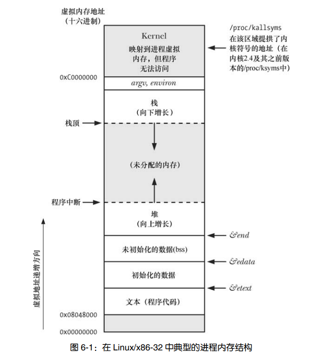
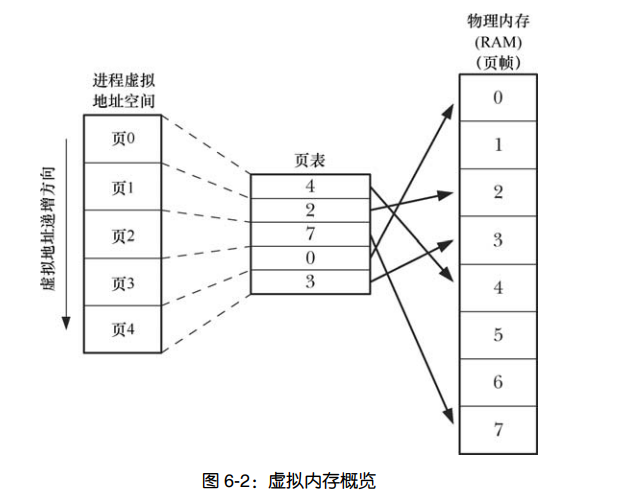

## 2. 进程

### 1. 进程定义
>进程是由内核定义的抽象实体，并为该实体分配用以执行程序所需要的各种系统资源。 （运行在内存中的程序称之为进程）

### 2. 进程id
>每个进程都有一个进程号，进程号是一个正数，用以标识系统中的一个进程
  ```c
    #include <sys/types.h>
    #include <unistd.h>

    // 获取进程pid
    pid_t getpid(void);
    // 获取父进程pid
    pid_t getppid(void);
        总是成功返回进程id给调用者
  ```

### 3. 进程内存布局

> 每个进程内存所分配的内存由很多部分组成，称之为段(segment)
> 1. 文本段(text): 包括了程序运行时需要的机器指令，文本段具有只读属性，因为多个进程可运行同一程序，所以又将文本段设置为共享，一分程序代码的拷贝可映射到所有这些进程的虚拟空间当中。
> 2. 初始化数据段(data): 包括显式初始化的全局变量和静态变量，程序运行时，当程序加载到内存时，从可执行文件读取这些变量的值。
> 3. 未初始化数据段(bss): 未经显式初始化的全局变量和静态变量，程序启动前，系统将本段的内存初始化为0。
> 4. 栈段(stack): 是一个动态增长的段，系统为每个当前调用的函数分配一个栈帧，栈帧存储了函数的局部变量，实参和返回值。
> 5. 堆(heap): 运行时动态进行内存分配的一块区域，堆顶端称之为program break。
---



---

```c
    #include <stdio.h>
    #include <stdlib.h>

    // data segment
    char data_var[1000] = {'d'};

    // bss
    char bss_var[1000];

    int main(int argc, char *argv[]) {
        // stack frame
        char stack_var[1000] = {'a'};

                                // heap
        char *heap_var = (char *)malloc(sizeof(char) * 1000);
        if (heap_var == NULL) {
            printf("malloc error\n");
            return -1;
        }

        free(heap_var);

        return 0;
}
    // size a.out 
    // text    data     bss     dec     hex filename
    // 2011    1640    1032    4683    124b a.out
```

### 4. 虚拟内存

> 1. 将每个程序使用的内存切割成小型的、固定大小的“页”（page）单元。
> 2. 将 RAM 划分成一系列与虚存页尺寸相同的页帧
> 3. 任一时刻，每个程序仅有部分页需要驻留在物理内存页帧中。这些页构成了所谓驻留集（resident set）。
> 4. 程序未使用的页拷贝保存在交换区（swap area）内—这是磁盘空间中的保留区域，作为计算机 RAM 的补充— 仅在需要时才会载入物理内存。
> 5. 若进程欲访问的页面目前并未驻留在物理内存中，将会发生页面错误（page fault），内核即刻挂起进程的执行，同时从磁盘中将该页面载入内存。

> 内核需要为每个进程维护一个页表。



> 使用虚拟内存的优点:
> - 进程之间相互隔离， 所以一个进程不能读取或修改另一个进程的内存。
> - 适当情况下，两个进程之间可以共享内存。 (进程间通信)
> - 便于实现内存保护机制；也就是说，可以对页表条目进行标记，以表示相关页面内容是可读、可写、可执行亦或是这些保护措施的组合。
> - 程序员和编译器、链接器之类的工具无需关注程序在 RAM 中的物理布局
> - 因为需要驻留在内存中的仅是程序的一部分，所以程序的加载和运行都很快。而且，一个进程所占用的内存（即虚拟内存大小）能够超出 RAM 容量。

### 5. 栈和栈帧

> 栈从高地址向低地址生长。
>
> 寄存器—栈指针（stack pointer），用于跟踪当前栈顶。每次调用函数时，会在栈上新分配一帧，每当函数返回时，再从栈上将此帧移去。
>

### 6. 非局部跳转 (setjmp / longjmp)

> 非局部（nonlocal）” 是指跳转的目标为当前执行函数之外的某个位置
>
> 在一个深度嵌套的函数调用中发生了错误，需要放弃当前任务，从多层函数调用中返回 需使用longjmp
> 
> 在调用这些函数时，为避免编译器优化所引发的问题，应使用 volatile 修饰符声明变量。非局部跳转会使程序难于阅读和维护，应尽量避免使用。

```c
    #include <setjmp.h>

    int setjmp(jmp_buf env);
        返回0第一次调用， 通过longjmp val参数,返回其他值
    void longjmp(jmp_buf env, int val);
```
```c
    // setjmp / longjmp demo
    #include <stdio.h>
    #include <setjmp.h>

    jmp_buf jmp;

    int test();
    int test1();
    int test2();

    int test() {
        printf("func test\n");
        test1();
    }

    int test1() {
        printf("func test1\n");
        test2();    
    }

    int test2() {
        printf("func test2\n");
        longjmp(jmp, 1);
    }

    int main(int argc, char *argv[]) {
        
        switch (setjmp(jmp))
        {
        case 0:
            // 初次调用setjmp 返回0 
            printf("main\n");
            test();
            break;
        case 1:
            printf("从test2函数返回\n");
            break;
        default:
            break;
        }
        return 0;
    }
```