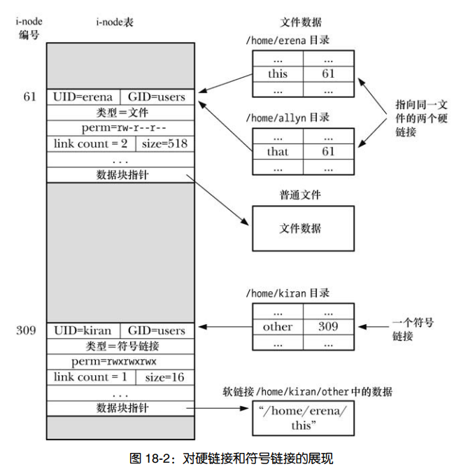

## 2. 文件和目录

## 1. 文件

### 1. 获取文件信息
   *  **stat() 系统调用**
        ```c
            #include <sys/types.h>
            #include <sys/stat.h>
            #include <unistd.h>

            // 查看pathname所指向文件的信息
            int stat(const char *pathname, struct stat *statbuf);

            // 查看由fd描述符指向的文件的信息
            int fstat(int fd, struct stat *statbuf);
            
            // 如果文件属于符号链接，那么所返回的信息针对的是符号链接自身（而非符号链接所指向的文件）。
            int lstat(const char *pathname, struct stat *statbuf);

            struct stat {
                dev_t     st_dev;         /* 设备id */
                ino_t     st_ino;         // i节点number
                mode_t    st_mode;        // 文件类型和权限
                nlink_t   st_nlink;       // 硬链接计数
                uid_t     st_uid;         // 文件所有者(uid)
                gid_t     st_gid;         // 文件所有组(gid)
                dev_t     st_rdev;        // 设备id(特殊设备)
                off_t     st_size;        // 文件大小(byte)
                blksize_t st_blksize;     // 是针对文件系统上文件进行 I/O 操作时的最优块大小（以字节为单位）。若 I/O 所采用的块大小小于该值，则被视为低效
                blkcnt_t  st_blocks;      // 分配给文件的块数量

                struct timespec st_atim;  // 最后访问时间
                struct timespec st_mtim;  // 最后修改时间
                struct timespec st_ctim;  // 文件状态最后改变时间

                #define st_atime st_atim.tv_sec      /* Backward compatibility */
                #define st_mtime st_mtim.tv_sec
                #define st_ctime st_ctim.tv_sec
            };
        ```

   - **设备id st_dev和i节点 st_ino**
    
      > 利用宏 major()和 minor()，可提取 dev_t 值的主、辅 ID。 打印时应总是将返回值强制转换为 long
      ```c
      #include <sys/sysmacros.h>

      dev_t makedev(unsigned int maj, unsigned int min);

      unsigned int major(dev_t dev);
      unsigned int minor(dev_t dev);
      ```
   - **文件类型和权限 st_mode**
  
      * > buf.st_mode 8进制

      * > 相关常量
        ```text
            // 文件类型
            S_IFSOCK   0140000   socket
            S_IFLNK    0120000   symbolic link
            S_IFREG    0100000   regular file
            S_IFBLK    0060000   block device
            S_IFDIR    0040000   directory
            S_IFCHR    0020000   character device
            S_IFIFO    0010000   FIFO

            // 宏定义
            S_ISREG(m)  is it a regular file?
            S_ISDIR(m)  directory?
            S_ISCHR(m)  character device?
            S_ISBLK(m)  block device?
            S_ISFIFO(m) FIFO (named pipe)?
            S_ISLNK(m)  symbolic link?  (Not in POSIX.1-1996.)
            S_ISSOCK(m) socket?  (Not in POSIX.1-1996.)

            // 文件权限
            S_ISUID     04000   set-user-ID bit
            S_ISGID     02000   set-group-ID bit
            S_ISVTX     01000   sticky bit
            S_IRWXU     00700   owner has read, write, and execute permission
            S_IRUSR     00400   owner has read permission
            S_IWUSR     00200   owner has write permission
            S_IXUSR     00100   owner has execute permission
            S_IRWXG     00070   group has read, write, and execute permission
            S_IRGRP     00040   group has read permission
            S_IWGRP     00020   group has write permission
            S_IXGRP     00010   group has execute permission
            S_IRWXO     00007   others (not in group) have read,  write,  and execute permission
            S_IROTH     00004   others have read permission
            S_IWOTH     00002   others have write permission
            S_IXOTH     00001   others have execute permission
        ```
        ```c
            printf("file type and mode = 0%o\n", buf.st_mode);
            //文件类型   文件权限
            //  010      0644

            // 测试文件类型
            stat(pathname, &sb);
            if ((sb.st_mode & S_IFMT) == S_IFREG) {
                /* Handle regular file */
            }

            // 也可用 S_ISREG, 相当于 st_mode & S_IFMT == S_IFREG
            stat(pathname, &sb);
            if (S_ISREG(sb.st_mode)) {
                /* Handle regular file */
            }
        ```
        

   - **文件大小 st_size**
      
        > 对于常规文件，st_size 字段表示文件的字节数。对于符号链接，则表示链接所指路径名的长度，以字节为单位。对于共享内存对象，该字段则表示对象的大小。

### 2. 改变文件时间戳

   ```c
    #include <sys/types.h>
    #include <utime.h>

    //显式改变存储于文件 i 节点中的文件上次访问时间戳和上次修改时间戳

    //如果 buf 为 NULL，那么会将文件的上次访问和修改时间同时置为当前时间
    //若将 buf 指定为指向 utimbuf 结构的指针，则会使用该结构的相应字段去更新文件的上次访问和修改时间
    int utime(const char *filename, const struct utimbuf *times);

    struct utimbuf {
        time_t actime;       /* access time */
        time_t modtime;      /* modification time */
    };
    // ------------------------------------------
    #include <fcntl.h> /* Definition of AT_* constants */
    #include <sys/stat.h>

    // 若有意将时间戳之一置为当前时间，则可将相应的 tv_nsec 字段指定为特殊值UTIME_NOW。若希望某一时间戳保持不变，则需把相应的 tv_nsec 字段指定为特殊值UTIME_OMIT。无论是上述哪一种情况，都将忽略相应 tv_sec 字段中的值。
    // dirfd 参数指定为 AT_FDCWD，此时对 pathname 参数的解读与 utimes()相类似。或者，也可以将其指定为指代目录的文件描述符。
    // flags 参数可以为 0，或者 AT_SYMLINK_NOFOLLOW，意即当 pathname 为符号链接时，不会对其解引用（也就是说，改变的是符号链接自身的时间戳）。相形之下，utimes()总是对符号链接进行解引用。
    //若将 times 指定为 NULL，则会将以上两个文件时间戳都更新为当前时间。若 times 值为非 NULL，则会针对指定文件在 times[0]中放置新的上次访问时间，在 times[1]中放置新的上次修改时间。
    int utimensat(int dirfd, const char *pathname,const struct timespec times[2], int flags);

    struct timespec {
        time_t tv_sec;        /* seconds */
        long   tv_nsec;       /* nanoseconds */
    };

    
    
    int futimens(int fd, const struct timespec times[2]);
   ```

### 3. 文件属组

1. > 文件创建时，其用户 ID“取自”进程的有效用户 ID。而新建文件的组 ID 则“取自”进程的有效组 ID

2. > 改变文件属组
   
    ```c
    #include <unistd.h>

    //参数 owner 和 group 分别为文件指定新的用户 ID 和组 ID。若只打算改变其中之一，只需将另一参数置为−1，即可令与之相关的 ID 保持不变

    // chown()改变由 pathname 参数命名文件的所有权。 
    int chown(const char *pathname, uid_t owner, gid_t group);

    // fchown()也会改变文件的所有权，只是文件由打开文件描述符 fd 所引用。
    int fchown(int fd, uid_t owner, gid_t group);

    // lchown()用途与 chown()相同，不同之处在于若参数 pathname 为一符号链接，则将会改变链接文件本身的所有权，而与该链接所指代的文件无干。
    int lchown(const char *pathname, uid_t owner, gid_t group);
    ```

### 4. 文件权限 

1. **文件权限掩码分为 3 类:**
   1. `Owner`：授予文件属主的权限。
   2. `Group`：授予文件属组成员用户的权限。
   3. `Other`：授予其他用户的权限。
   
2. **可为每一类用户授予的权限如下所示**
   1. `Read`：可阅读文件的内容。
   2. `Write`：可更改文件的内容。
   3. `Execute`：可以执行文件（亦即，文件是程序或脚本）。要执行脚本文件，需同时具备读权限和执行权限。

3. **SET-UID, SET-GID, stick位**
   1. set-uid: 会将进程有效用户 ID 置为文件属主的用户 ID。
   2. set-gid: 会将进程有效组 ID 置为文件属组的 ID。
   3. stick： 作用于目录时，sticky 权限位起限制删除位的作用。为目录设置该位，则表明仅当非特权进程具有对目录的写权限，且为文件或目录的属主时，才能对目录下的文件进行删除（unlink()、rmdir()）和重命名（rename()）操作。
   
### 5. 目录权限
   
   1. `读权限`：可列出（比如，通过 ls 命令）目录之下的内容（即目录下的文件名）。
   
   2. `写权限`：可在目录内创建、删除文件。注意，要删除文件，对文件本身无需有任何权限。
   
   3. `可执行权限`：可访问目录中的文件。因此，有时也将对目录的执行权限称为 search（搜索）权限

   > 拥有对目录的读权限，用户只是能查看目录中的文件列表。要想访问目录内文件的内容或是这些文件的 i 节点信息，还需握有对目录的执行权限。

   > 若拥有对目录的可执行权限，而无读权限，只要知道目录内文件的名称，仍可对其进行访问，但不能列出目录下的内容（即目录所含的其他文件名）。在控制对公共目录内容的访问时，这是一种常用技术，简单而且实用。

   > 要想在目录中添加或删除文件，需要同时拥有对该目录的执行和写权限。

### 6. 权限检查

   ```text
   1. 对于特权级进程，授予其所有访问权限。
   
   2. 若进程的有效用户 ID 与文件的用户 ID（属主）相同，内核会根据文件的属主权限，授予进程相应的访问权限。比方说，若文件权限掩码中的属主读权限（owner-read permission）位被置位，则授予进程读权限。否则，则拒绝进程对文件的读取操作。

   3. 若进程的有效组 ID 或任一附属组 ID 与文件的组 ID（属组）相匹配，内核会根据文件的属组权限，授予进程对文件的相应访问权限。

   4. 若以上三点皆不满足，内核会根据文件的 other(其他)权限，授予进程相应权限
   ```

### 7. 检查对文件的访问
   
   ```c
    #include <unistd.h>

    // 是根据进程的真实用户 ID 和组 ID（以及附属组 ID），去检查对pathname 参数所指定文件的访问权限。
    int access(const char *pathname, int mode);
   ```

   `mode`:
   1. `F_OK`: 是否有这个文件。
   2. `R_OK`: 对这个文件可以读吗？
   3. `W_OK`: 对这个文件可以写吗？
   4. `X_OK`: 对这个文件可以执行吗？
   
### 8. 其他函数
   
   ```c
    #include <sys/types.h>
    #include <sys/stat.h>

    // 当进程新建文件或目录时，该属性用于指明应屏蔽哪些权限位。
    mode_t umask(mode_t mask);
   ```

   ```c
    #include <sys/stat.h>

    // 更改由 pathname 参数所指定文件的权限。若该参数所指为符号链接，调用 chmod()会改变符号链接所指代文件的访问权限，而非对符号链接自身的访问权限。
    //（符号链接自创建起，其所有权限便为所有用户共享，且这些权限也不得更改。对符号链接解引用时，将忽略所有这些权限。）
    int chmod(const char *pathname, mode_t mode);

    // 更改由打开文件描述符 fd 所指代文件的权限。
    int fchmod(int fd, mode_t mode);
   ```

## 2. 目录

### 1. 目录和文件的区别
   
   1. 在其inode条目中，会将目录标记为一种特殊的文件类型。
   2. 目录是经特殊组织成的文件，本质是一个表格，包括文件名和inode编号。
   
   


   > 文件 i-node中存储的信息列表，其中并未包含文件名，而仅通过目录列表内的一个映射来定义文件名称。其妙用在于，能够在相同或者不同目录中创建多个名称，每个均指向相同的 i-node 节点。也将这些名称称为链接，有时也称之为硬链接。

   > 在 Linux 系统上，借助于 readdir()对 Linux 特有/proc/PID/fd 目录内容（内含符号链接指向进程当前打开的每个文件描述符）的扫描，可以获知一个进程当前打开了哪些文件。

### 2. 硬链接和软链接

   1. **硬链接限制**
    
      - > 因为目录条目（硬链接）对文件的指代采用了 i-node 编号，而 i-node 编号的唯一性仅在一个文件系统之内才能得到保障，所以硬链接必须与其指代的文件驻留在同一文件系统中。
      - > 不能为目录创建硬链接，从而避免出现令诸多系统程序陷于混乱的链接环路。
  
   2. **软链接**
   
      - > 软链接是一种特殊的文件类型，其数据是另一文件的名称。
      - > 符号链接的内容既可以是绝对路径，也可以是相对路径。解释相对符号链接时以链接本身的位置作为参照点。
      - > 如果移除了符号链接所指向的文件名，符号链接本身还将继续存在，尽管无法再对其进行解引用（下溯）操作，也将此类链,接称之为悬空链接。还可以为并不存在的文件名创建一个符号链接。
      - > 当移除指向文件的最后一个链接时，如果仍有进程持有指代该文件的打开文件描述符，那么在关闭所有此类描述符之前，系统实际上将不会删除该文件。
  
      


   3. **link和unlink函数**
       
       ```c
        #include <unistd.h>
        
        // 为一个已存在的文件创建一个硬链接
        int link(const char *oldpath, const char *newpath);
        
        // 移除一个链接（删除一个文件名），且如果此链接是指向文件的最后一个链接，那么还将移除文件本身。
        int unlink(const char *pathname);
       ```
    
   4. **symlink和readlink函数**
   
       ```c
        #include <unistd.h>

        // 会针对由 filepath 所指定的路径名创建一个新的符号链接。（想移除符号链接，需使用 unlink()调用。
        int symlink(const char *target, const char *linkpath);

        // 将符号链接字符串的一份副本置于 buffer 指向的字符数组中。
        ssize_t readlink(const char *pathname, char *buf, size_t bufsiz);
            成功: 返回实际放入 buffer 中的字节数。若链接长度超过 bufsiz，则置于 buffer 中的是经截断处理的字符串（并返回字符串大小，亦即 bufsiz）。
            失败: 返回-1 并设置errno
       ```
   5. **rename函数**
   
      ```c
        #include <stdio.h>

        // 借助于 rename()系统调用，既可以重命名文件，又可以将文件移至同一文件系统中的另一目录。
        int rename(const char *oldpath, const char *newpath);
      ```

   6. **mkdir和rmdir函数**
     
      ```c
        #include <sys/stat.h>
        #include <sys/types.h>

        // 创建一个目录
        int mkdir(const char *pathname, mode_t mode);

        // 移除一个目录
        int rmdir(const char *pathname);
      ```

   7. **opendir和readdir函数**
   
      ```c
        #include <sys/types.h>
        #include <dirent.h>
        
        // 打开一个目录，并返回指向该目录的句柄
        DIR *opendir(const char *name);
        
        #include <dirent.h>

        // 就从 dirp 所指代的目录流中读取下一目录条目，并返回一枚指针，指向经静态分配而得的 dirent 类型结构
        struct dirent *readdir(DIR *dirp);

        struct dirent {
            ino_t          d_ino;       // 文件的inode编号
            off_t          d_off;
            unsigned short d_reclen;    // 返回记录的大小
            unsigned char  d_type;      // 文件类型 
            char           d_name[256]; // 以NULL结尾的文件名
        };

      ```
   8. **rewinddir和closedir函数**
      ```c
        #include <sys/types.h>
        #include <dirent.h>

        // 将目录流回移到起点，以便对 readdir()的下一次调用将从目录的第一个文件开始
        void rewinddir(DIR *dirp);

        // 将由 dirp 指代、处于打开状态的目录流关闭，同时释放流所使用的资源。
        int closedir(DIR *dirp);
      ```

   9. **dirfd函数**
   
      ```c
        #include <sys/types.h>
        #include <dirent.h>

        // 获取目录流的文件描述符
        int dirfd(DIR *dirp);
      ```

   10. **chdir和chroot函数**

       ```c
        #include <unistd.h>

        // 将调用进程的当前工作目录改变为由 pathname 指定的相对或绝对路径名
        int chdir(const char *path);
        
        // 改变一个进程的根目录
        int chroot(const char *path);
       ```

   11. **dirname和basename函数**
   
       ```c
        #include <libgen.h>

        // 将一个路径名字符串分解成目录和文件名两部分
        char *dirname(char *path);
        char *basename(char *path);
       ```
   12. **nftw文件树遍历**
   
       ```c
        #include <ftw.h>

        // 对整个目录子树进行递归遍历，并为子树中的每个文件执行某些操作（即，调用由程序员定义的函数）
        // 应用程序提前终止目录树遍历的唯一方法就是让 fn 调用返回一个非 0 值。
        int nftw(const char *dirpath,
            int (*fn) (const char *fpath, const struct stat *sb, int typeflag, struct FTW *ftwbuf),
            int nopenfd, int flags);
       ```

       `flags`:
          - `FTW_CHDIR`: 在处理目录内容之前先调用 chdir()进入每个目录。
          - `FTW_DEPTH`: 对目录树执行后序遍历。
          - `FTW_MOUNT`: 不会越界进入另一文件系统。因此，如果树中某一子目录是挂载点，那么不会对其进行遍历。
          - `FTW_PHYS`: 不对符号链接进行解引用操作。
  
       `typeflag`:
         - `FTW_D`: 这是一个目录。
         - `FTW_DNR`: 这是一个不能读取的目录。
         - `FTW_DP`: 正在对一个目录进行后序遍历，当前项是一个目录，其所包含的文件和子目录已经处理完毕。
         - `FTW_F`: 该文件的类型是除目录和符号链接以外的任何类型。
         - `FTW_NS`: 对该文件调用 stat()失败。
         - `FTW_SL`: 这是一个符号链接。仅当使用 FTW_PHYS 标志调用 nftw()函数时才返回该值。
         - `FTW_SLN`: 这是一个悬空的符号链接。仅当未在flags参数中指定FTW_PHYS标志时才会出现该值。