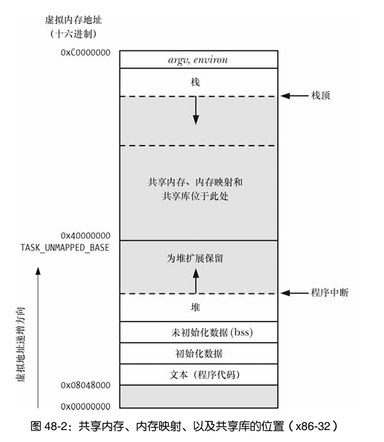

## 8. IPC

### 1. PIPE和FIFO

1. **概述**
   
   > 可以将管道看成是一组铅管，它允许数据从一个进程流向另一个进程。

   - 一个管道是一个字节流
   - 试图从一个当前为空的管道中读取数据将会被阻塞直到至少有一个字节被写入到管道中为止。如果管道的写入端被关闭了，那么从管道中读取数据的进程在读完管道中剩余的所有数据之后将会看到文件结束（即 read()返回 0）。
   - 在管道中数据的传递方向是单向的。管道的一段用于写入，另一端则用于读取。
   - 管道其实是一个在内核内存中维护的缓冲器，这个缓冲器的存储能力是有限的。

2. **创建管道**
    ```c
    #include <unistd.h>

    // 会在数组 filedes 中返回两个打开的文件描述符：一个表示管道的读取端（filedes[0]），另一个表示管道的写入端（filedes[1]）。
    int pipe(int pipefd[2]);
    ```

    ```c
    // pipe demo 类似 ls | wc -l
    #include <stdio.h>
    #include <errno.h>
    #include <stdlib.h>
    #include <unistd.h>
    #include <sys/wait.h>
    #include <signal.h>

    #define handle_error_en(en, msg) \
    do { errno = en; perror(msg); exit(EXIT_FAILURE); } while (0)

    #define handle_error(msg) \
    do { perror(msg); exit(EXIT_FAILURE); } while (0)

    int main(int argc, char *argv[]) {
        int pipefd[2];
        if (pipe(pipefd) == -1) {
            handle_error("pipe");
        }
        for (int i=0; i<2; i++) {
            if (i == 0) {
                switch (fork())
                {
                case 0:
                    // child
                    close(pipefd[0]);
                    if (pipefd[1] != STDOUT_FILENO) {
                        dup2(pipefd[1], STDOUT_FILENO);
                        close(pipefd[1]);
                    }
                    execlp("ls", "ls", (char *)0);
                    _exit(EXIT_SUCCESS);
                    break;
                case -1:
                    handle_error("fork");
                default:
                    // parent
                    break;
                }
            }

            if (i == 1) {
                switch (fork())
                {
                case 0:
                    // child
                    close(pipefd[1]);
                    if (pipefd[0] != STDIN_FILENO) {
                        dup2(pipefd[0], STDIN_FILENO);
                        close(pipefd[0]);
                    }
                    
                    execlp("wc", "wc", "-l", (char *)0);
                    _exit(EXIT_SUCCESS);
                    break;
                case -1:
                    handle_error("fork");
                default:
                    // parent
                    break;
                }
            }
        }

        close(pipefd[0]);
        close(pipefd[1]);
        wait(NULL);
        wait(NULL);
        return 0;
    }
    ```
3. **通过管道与 shell 命令进行通信**
   
   > 由于 popen()调用返回的文件流指针没有引用一个终端，因此 stdio 库会对这种文件流应用块缓冲

   ```c
    #include <stdio.h>

    // 创建了一个管道，然后创建了一个子进程来执行 shell，而 shell 又创建了一个子进程来执行 command 字符串。
    // mode 参数是一个字符串，它确定调用进程是从管道中读取数据（mode 是 r）还是将数据写入到管道中（mode 是 w）。
    FILE *popen(const char *command, const char *type);

    int pclose(FILE *stream);
   ```

   ```c
    #define _POSIX_C_SOURCE 2
    #include <stdio.h>
    #include <errno.h>
    #include <stdlib.h>

    #define handle_error(msg) \
    do { perror(msg); exit(EXIT_FAILURE); } while (0)

    int main(int argc, char *argv[]) {
        
        FILE *fp = popen("ps aux |grep sleep", "r");
        if (fp == NULL) {
            handle_error("popen");
        }
        char c;
        for (;;) {
            c = fgetc(fp);
            if (c == EOF) {
                break;
            }
            putc(c, stdout);
        }
        pclose(fp);
        return 0;
    }
   ```
4. **FIFO**
   
   > 从语义上来讲，FIFO 与管道类似，它们两者之间最大的差别在于 FIFO 在文件系统中拥有一个名称，并且其打开方式与打开一个普通文件是一样的。这样就能够将 FIFO 用于非相关进程之间的通信（如客户端和服务器）。

   > FIFO 有时候也被称为命名管道。
   
   > 使用 mkfifo 命令可以在 shell 中创建一个 FIFO。

   > 打开一个 FIFO 以便读取数据（open() O_RDONLY 标记）将会阻塞直到另一个进程打开 FIFO 以写入数据（open() O_WRONLY 标记）为止。相应地，打开一个 FIFO 以写入数据将会阻塞直到另一个进程打开FIFO 以读取数据为止。

   ```c
    #include <sys/types.h>
    #include <sys/stat.h>

    // 创建一个名为 pathname 的全新的 FIFO。
    int mkfifo(const char *pathname, mode_t mode);
   ```
### 2. System V 消息队列

1. **概述**
   
   > 消息队列允许进程以消息的形式交换数据。

   > 通过消息队列进行的通信是面向消息的，即读者接收到由写者写入的整条消息。读取一条消息的一部分而让剩余部分遗留在队列中或一次读取多条消息都是不可能的。

   > 总体上来讲，最好避免使用 System V 消息队列。当碰到需要使用根据类型选择消息的工具的情况时应该考虑使用其他替代方案。

2. **创建和使用**
   
   ```c
    #include <sys/types.h>
    #include <sys/ipc.h>
    #include <sys/msg.h>

    // 创建一个新消息队列或取得一个既有队列的标识符。
    // key 即通常是值 IPC_PRIVATE 或ftok()返回的一个键
    // msgflg 参数是一个指定施加于新消息队列之上的权限或检查一个既有队列的权限的位掩码。
    int msgget(key_t key, int msgflg);
   ```
   `msgflg`:
   1. `IPC_CREAT`: 如果没有与指定的 key 对应的消息队列，那么就创建一个新队列。
   2. `IPC_EXCL`: 如果同时还指定了 IPC_CREAT 并且与指定的 key 对应的队列已经存在，那么调用就会失败并返回 EEXIST 错误。
   
3. **发送和接收消息**
   
   ```c
    #include <sys/types.h>
    #include <sys/ipc.h>
    #include <sys/msg.h>

    // msgid: 消息队列标识符
    // msgp 用于存放被发送或接收的消息。
    // msgsz 参数指定了 mtext 字段中包含的字节数。
    // msgflg: IPC_NOWAIT 执行一个非阻塞的发送操作。

    // 发送消息必须要将消息结构中的 mtype 字段的值设为一个大于 0 的值
    int msgsnd(int msqid, const void *msgp, size_t msgsz, int msgflg);

    // 从消息队列中读取（以及删除）一条消息并将其内容复制进 msgp 指向的缓冲区中。
    ssize_t msgrcv(int msqid, void *msgp, size_t msgsz, long msgtyp,
                    int msgflg);
    
    struct msgbuf {
        long mtype;       /* 消息类型, must be > 0 */
        char mtext[1];    /* 消息体，其长度和内容可以是任意的，而无需是一个字符数组。*/ 
    };
   ```
4. **消息队列控制**
   
   ```c
    #include <sys/types.h>
    #include <sys/ipc.h>
    #include <sys/msg.h>

    int msgctl(int msqid, int cmd, struct msqid_ds *buf);

    struct msqid_ds {
        struct ipc_perm msg_perm;     /* Ownership and permissions */
        time_t          msg_stime;    /* Time of last msgsnd(2) */
        time_t          msg_rtime;    /* Time of last msgrcv(2) */
        time_t          msg_ctime;    /* Time of last change */
        unsigned long   __msg_cbytes; /* Current number of bytes in
                                        queue (nonstandard) */
        msgqnum_t       msg_qnum;     /* Current number of messages
                                        in queue */
        msglen_t        msg_qbytes;   /* Maximum number of bytes
                                        allowed in queue */
        pid_t           msg_lspid;    /* PID of last msgsnd(2) */
        pid_t           msg_lrpid;    /* PID of last msgrcv(2) */
    };
   ```
   `cmd`:
   1. `IPC_RMID`: 立即删除消息队列对象及其关联的 msqid_ds 数据结构。
   
   2. `IPC_STAT`: 将与这个消息队列关联的 msqid_ds 数据结构的副本放到 buf 指向的缓冲区中。
   
   3. `IPC_SET`: 使用buf指向的缓冲区提供的值更新与这个消息队列关联的msqid_ds数据结构中被选中的字段。
   
5. **消息队列限制**
   
   - `MSGMNI`: 这是系统级别的一个限制，它规定了系统中所能创建的消息队列标识符的数量。
   - `MSGMAX`: 这是系统级别的一个限制，它规定了单条消息中最多可写入的字节数（mtext）。
   - `MSGMNB`: 一个消息队列中一次最多保存的字节数（mtext）。
   - `MSGTQL`: 这是系统级别的一个限制，它规定了系统中所有消息队列所能存放的消息总数。
   - `MSGPOOL`: 这是系统级别的一个限制，它规定了用来存放系统中所有消息队列中的数据的缓冲池的大小。
  
6. **消息队列测试demo**
   ```c
    #define _GNU_SOURCE
    #include <stdio.h>
    #include <errno.h>
    #include <stdlib.h>
    #include <sys/types.h>
    #include <sys/ipc.h>
    #include <sys/msg.h>
    #include <string.h>

    #define handle_error(msg) \
    do { perror(msg); exit(EXIT_FAILURE); } while (0)

    struct message {
        long mtype;
        char mtext[BUFSIZ];
    };

    int msg_create() {
        
        int ret = 0;

        if ((ret = msgget(IPC_PRIVATE, IPC_CREAT)) == -1) {
            perror("msgget");
            return -1;
        }

        return ret;
    }


    int main(int argc, char *argv[]) {
        
        if (argc == 1) {
            printf("./a.out create\n");
            printf("./a.out ls\n");
            printf("./a.out id rm\n");
            printf("./a.out id send data\n");
            printf("./a.out id read\n");
            exit(EXIT_FAILURE);
        }
        if (argc == 2) {
            // create msgid
            if (strcmp(argv[1], "create") == 0) {
                // a.out create
                int id = msg_create();
                if (id == -1) {
                    exit(EXIT_FAILURE);
                }
                printf("%d\n", id);
                exit(EXIT_SUCCESS);
            }

            // list all msgid
            if (strcmp(argv[1], "ls") == 0) {
        
                int maxind,msgid;
                struct msginfo info;
                struct msqid_ds ds;

                if ((maxind = msgctl(0, MSG_INFO, (struct msqid_ds*)&info)) == -1) {
                    handle_error("msgctl MSG_INFO");
                }
                printf("index   id      message\n");
                for (int i=0; i<=maxind; i++) {
                    if ((msgid = msgctl(i, MSG_STAT, &ds)) == -1) {
                        if (errno != EINVAL) {
                            handle_error("msgctl MSG_STAT");
                        }
                        continue;
                    }  
                    
                    printf("%3d %6d %8ld\n", i, msgid, (long)ds.msg_qnum);
                }

                exit(EXIT_SUCCESS);
            }
        }
        
        if (argc == 3) {
            // read data 
            if (strcmp(argv[2], "read") == 0) {
                // a.out id read
                int id = atoi(argv[1]);
                struct message buf;
                if (msgrcv(id, &buf, BUFSIZ, 0, 0) == -1) {
                    handle_error("msgrcv");
                }
                printf("type:%ld message: %s\n", buf.mtype, buf.mtext);
                exit(EXIT_SUCCESS);
            }

            // remove msgid
            if (strcmp(argv[2], "rm") == 0) {
                // a.out id rm
                int id = atoi(argv[1]);
                if (msgctl(id, IPC_RMID, NULL) == -1) {
                    handle_error("msgctl IPC_RMID");
                }
                printf("delete msgid %d successed\n", id);
                exit(EXIT_SUCCESS);
            }

        }

        // send data
        if (argc == 4 && strcmp(argv[2], "send") == 0) {
            // a.out id send data
            struct message buf;
            buf.mtype = 1;
            strncpy(buf.mtext, argv[3], BUFSIZ);
            ssize_t len = strlen(argv[3]) + 1;
            if (msgsnd(atoi(argv[1]), &buf, len, 0) == -1) {
                handle_error("msgsnd");
            }
            exit(EXIT_SUCCESS);
        }

        return 0;
    }
   ```

### 3. System V 信号量

1. **概述**
   
   > 信号量的一个常见用途是同步对一块共享内存的访问以防止出现一个进程在访问共享内存的同时另一个进程更新这块内存的情况。

   > 一个信号量是一个由内核维护的整数，其值被限制为大于或等于 0。

   在一个信号量上可以执行各种操作（即系统调用），包括：
   - 将信号量设置成一个绝对值；
   - 在一个信号量上可以执行各种操作（即系统调用），包括：
   - 在信号量当前值的基础上减去一个数量；
   - 等待信号量的值等于 0。

2. **创建和获取信号量**
   
   ```c
    #include <sys/types.h>
    #include <sys/ipc.h>
    #include <sys/sem.h>
    
    // key 参数是通常使用值 IPC_PRIVATE 或由ftok()返回的键。

    // 如果使用 semget()创建一个新信号量集，那么 nsems 会指定集合中信号量的数量，并且其值必须大于 0。如果使用 semget()来获取一个既有集的标识符，那么 nsems 必须要小于或等于集合的大小（否则会发生 EINVAL 错误）。无法修改一个既有集中的信号量数量。

    // semflg 参数是一个位掩码，它指定了施加于新信号量集之上的权限或需检查的一个既有集合的权限。
    // semflg: IPC_CREAT IPC_EXCL 

    // 创建一个新信号量集或获取一个既有集合的标识符。
    int semget(key_t key, int nsems, int semflg);
   ```

3. **信号量控制**
   
   ```c
    #include <sys/types.h>
    #include <sys/ipc.h>
    #include <sys/sem.h>

    // semid 参数是操作所施加的信号量集的标识符。对于那些在单个信号量上执行的操作，semnum 参数标识出了集合中的具体信号量。对于其他操作则会忽略这个参数，并且可以将其设置为 0。

    // cmd 参数指定了需执行的操作。
    int semctl(int semid, int semnum, int cmd, ...);

    // 第四个参数 在程序中必须要显式地定义这个union。

    union semun {
        int              val;    /* Value for SETVAL */
        struct semid_ds *buf;    /* Buffer for IPC_STAT, IPC_SET */
        unsigned short  *array;  /* Array for GETALL, SETALL */
        struct seminfo  *__buf;  /* Buffer for IPC_INFO
                                    (Linux-specific) */
    };
   ```

   `cmd`:
   1. `IPC_RMID`: 立即删除信号量集及其关联的semid_ds 数据结构。
   2. `IPC_STAT`: 在 arg.buf 指向的缓冲器中放置一份与这个信号量集相关联的 semid_ds 数据结构的副本。
   3. `IPC_SET`: 使用 arg.buf 指向的缓冲器中的值来更新与这个信号量集相关联的 semid_ds 数据结构中选中的字段。
   4. `GETVAL`: 返回由 semid 指定的信号量集中第 semnum 个信号量的值。这个操作无需 arg 参数。
   5. `SETVAL`: 将由 semid 指定的信号量集中第 semnum 个信号量的值初始化为 arg.val。
   6. `GETALL`: 获取由 semid 指向的信号量集中所有信号量的值并将它们放在 arg.array 指向的数组中。
   7. `SETALL`: 使用 arg.array 指向的数组中的值初始化 semid 指向的集合中的所有信号量。
   8. `GETPID`: 返回上一个在该信号量上执行 semop()的进程的进程 ID。
   9. `GETNCNT`: 返回当前等待该信号量的值增长的进程数。
   10. `GETZCNT`: 返回当前等待该信号量的值变成 0 的进程数。

4.  **信号量操作**

    ```c
    #include <sys/types.h>
    #include <sys/ipc.h>
    #include <sys/sem.h>

    // sops 参数是一个指向数组的指针，数组中包含了需要执行的操作

    // 在 semid 标识的信号量集中的信号量上执行一个或多个操作。

    // nsops 参数给出了数组的大小（数组至少需包含一个元素）。
    int semop(int semid, struct sembuf *sops, size_t nsops);

    struct sembuf {
        unsigned short int sem_num;	/* semaphore number */
        short int sem_op;		/* semaphore operation */
        short int sem_flg;		/* operation flag */
    };

    // 如果 sem_op 大于 0，那么就将 sem_op 的值加到信号量值上。
    // 如果 sem_op 等于 0，那么就对信号量值进行检查以确定它当前是否等于 0。
    // 如果 sem_op 小于 0，那么就将信号量值减去 sem_op。

    // sem_flag: 
    //  IPC_NOWAIT: 非阻塞等待。
    //  SEM_UNDO: 当指定这个标记时，内核会记录信号量操作的效果，然后在进程终止时撤销这个操作。
    ```
5. **信号量限制**
   
   - `SEMAEM`: 在 semadj 总和中能够记录的最大值。
   - `SEMMNI`: 这是系统级别的一个限制，它限制了所能创建的信号量标识符的数量。
   - `SEMMSL`: 一个信号量集中能分配的信号量的最大数量。
   - `SEMMNS`: 这是系统级别的一个限制，它限制了所有信号量集中的信号量数量。
   - `SEMOPM`: 每个 semop()调用能够执行的操作的最大数量。
   - `SEMVMX`: 一个信号量能取的最大值。
   - `SEMMNU`: 这是系统级别的一个限制，它限制了信号量撤销结构的总数量。
   - `SEMUME`: 每个信号量撤销结构中撤销条目的最大数量。
  
### 4. System V 共享内存

1. **概述**
   
   > 共享内存允许两个或多个进程共享物理内存的同一块区域（通常被称为段）。

   > 这种 IPC 技术的速度更快。

   > 共享内存这种 IPC 机制不由内核控制意味着通常需要通过某些同步方法使得进程不会出现同时访问共享内存的情况。

2. **创建共享内存**
   ```c
    #include <sys/ipc.h>
    #include <sys/shm.h>

    // 创建一个新共享内存段或获取一个既有段的标识符。新创建的内存段中的内容会被初始化为0。
    // size则是一个正整数，它表示需分配的段的字节数。
    // shmflg: IPC_CREAT IPC_EXCL
    // - SHM_HUGETLB: 创建一个使用巨页的共享内存段。
    // - SHM_NORESERVE
    int shmget(key_t key, size_t size, int shmflg);
   ```
3. **使用共享内存**
   ```c
    #include <sys/types.h>
    #include <sys/shm.h>

    // 将shmid 标识的共享内存段附加到调用进程的虚拟地址空间中。
    // 如果shmaddr 是NULL，那么段会被附加到内核所选择的一个合适的地址处。
    // 如果shmaddr 不为NULL并且没有设置SHM_RND，那么段会被附加到由shmaddr指定的地址处，它必须是系统分页大小的一个倍数（否则会发生EINVAL错误）
    // 如果 shmaddr 不为 NULL 并且设置了 SHM_RND，那么段会被映射到的地址为在shmaddr 中提供的地址被舍入到最近的常量SHMLBA（shared memory low boundary address）的倍数。
    // shmflg:
    // - SHM_RDONLY: 附加只读段 
    // - SHM_REMAP: 替换位于shmaddr处的任意既有映射 
    // - SHM_RND: 将shmaddr 四舍五入为SHMLBA字节的倍数 
    void *shmat(int shmid, const void *shmaddr, int shmflg);

    // 将共享内存段分离出其虚拟地址空间。
    // shmaddr参数标识出了待分离的段
    int shmdt(const void *shmaddr);
   ```
4. **共享内存在虚拟内存中的位置**
   
   > 附加共享内存段的虚拟地址从0x40000000开始。内存映射和共享库也是被放置在这个区域中的。

   > 地址0x40000000 被定义成了内核常量TASK_UNMAPPED_BASE。通过将这个常量定义成一个不同的值并且重建内核可以修改这个地址的值。

   > 在附加一个共享内存段时推荐的做法是允许内核选择将段附加在进程的虚拟地址空间的何处。这意味着段在不同进程中虚拟地址可能是不同的。正因为这个原因，所有对段中地址的引用都应该表示成为相对偏移量，而不是一个绝对指针。 

   

5. **共享内存控制**
   ```c
    #include <sys/ipc.h>
    #include <sys/shm.h>

    // cmd 和 信号量 消息队列中的cmd类似
    int shmctl(int shmid, int cmd, struct shmid_ds *buf);

    // cmd:
    // - SHM_LOCK: 将一个共享内存段锁进内存。
    // - SHM_UNLOCK: 为共享内存段解锁以允许它被交换出去。
   ```
6. **共享内存限制**
   
   - `SHMMNI`: 这是一个系统级别的限制，它限制了所能创建的共享内存标识符。
   - `SHMMIN`: 这个一个共享内存段的最小大小（字节数）。
   - `SHMMAX`: 这个是一个共享内存段的最大大小（字节数）。SHMMAX的实际上限依赖于可用的RAM和交换空间。
   - `SHMALL`: 这是一个系统级别的限制，它限制了共享内存中的分页总数。
   - `SHMSEG`: 这个是进程级别的限制，它限制了所能附加的共享内存段数量。
  
### 5. **POSIX 消息队列**

1. **创建消息队列**
   ```c
    #include <fcntl.h>           /* For O_* constants */
    #include <sys/stat.h>        /* For mode constants */
    #include <mqueue.h>

    // 创建一个新消息队列或打开一个既有队列。
    mqd_t mq_open(const char *name, int oflag);
    mqd_t mq_open(const char *name, int oflag, mode_t mode,
                    struct mq_attr *attr);

    struct mq_attr {
        long mq_flags;       /* Flags (ignored for mq_open()) */
        long mq_maxmsg;      /* 使用mq_send()向消息队列添加消息的数量上限 */
        long mq_msgsize;     /* 加入消息队列的每条消息的大小的上限 */
        long mq_curmsgs;     /* # of messages currently in queue
                                (ignored for mq_open()) */
    };

    Link with -lrt.
   ```
   `oflag`:
   1. `O_CREAT`: 队列不存在时创建队列 
   2. `O_EXCL`: 与O_CREAT一起使用时队列已存在时报错
   3. `O_RDONLY`: 只读打开
   4. `O_WRONLY`: 只写打开 
   5. `O_RDWR`: 读写模式打开
   6. `O_NONBLOCK`: 以非阻塞模式打开

2. **获取和设置消息队列属性**
   ```c
    #include <mqueue.h>

    int mq_getattr(mqd_t mqdes, struct mq_attr *attr);

    // 使用mq_setattr()能够修改的唯一特性是O_NONBLOCK标记的状态。
    int mq_setattr(mqd_t mqdes, const struct mq_attr *newattr,
                    struct mq_attr *oldattr);

    struct mq_attr {
        long mq_flags;       /* Flags: 0 or O_NONBLOCK */
        long mq_maxmsg;      /* Max. # of messages on queue */
        long mq_msgsize;     /* Max. message size (bytes) */
        long mq_curmsgs;     /* # of messages currently in queue */
    };

    Link with -lrt.
   ```

3. **关闭消息队列**
   ```c
    #include <mqueue.h>

    // 关闭消息队列描述符mqdes。
    int mq_close(mqd_t mqdes);

    Link with -lrt.
   ```

4. **删除一个消息队列**
   ```c
    #include <mqueue.h>

    // 删除通过 name 标识的消息队列
    int mq_unlink(const char *name);

    Link with -lrt.
   ```
5. **发送消息**
   ```c
    #include <mqueue.h>

    // 将位于 msg_ptr 指向的缓冲区中的消息添加到描述符mqdes所引用的消息队列中。
    // msg_len 参数指定了msg_ptr 指向的消息的长度，其值必须小于或等于队列的mq_msgsize
    // 消息在队列中是按照优先级倒序排列的（即0表示优先级最低）通过msg_prio参数指定
    // 
    int mq_send(mqd_t mqdes, const char *msg_ptr,
                    size_t msg_len, unsigned int msg_prio);

    Link with -lrt.
   ```
6. **接收消息**
   ```c
    #include <mqueue.h>


    // 从 mqdes 引用的消息队列中删除一条优先级最高、存在时间最长的消息并将删除的消息放置在msg_ptr指向的缓冲区。
    ssize_t mq_receive(mqd_t mqdes, char *msg_ptr,
                        size_t msg_len, unsigned int *msg_prio);

    Link with -lrt.
   ```
7. **消息通知**
   ```c
    #include <mqueue.h>

    // 注册调用进程在一条消息进入描述符mqdes引用的空队列时接收通知。
    int mq_notify(mqd_t mqdes, const struct sigevent *sevp);

    Link with -lrt.
   ```
8. **通过命令行显示和删除消息队列对象**
   > mount mqueue none /dev/mqueue

### 6. **POSIX 信号量**

1. **创建信号量**
   ```c
    #include <fcntl.h>           /* For O_* constants */
    #include <sys/stat.h>        /* For mode constants */
    #include <semaphore.h>

    // 创建和打开一个新的命名信号量或打开一个既有信号量。
    sem_t *sem_open(const char *name, int oflag);
    // value参数是一个无符号整数，它指定了新信号量的初始值。
    sem_t *sem_open(const char *name, int oflag,
                    mode_t mode, unsigned int value);

    Link with -pthread.
   ```
2. **关闭信号量**
   ```c
    #include <semaphore.h>

    // 释放系统为该进程关联到该信号量之上的所有资源，并递减引用该信号量的进程数。
    int sem_close(sem_t *sem);

    Link with -pthread.
   ```

3. **删除信号量**
   ```c
    #include <semaphore.h>

    // 删除通过 name 标识的信号量并将信号量标记成一旦所有进程都使用完这个信号量时就销毁该信号量
    int sem_unlink(const char *name);

    Link with -pthread.
   ```

4. **信号量操作**
   ```c
    #include <semaphore.h>

    // 递增（增加1）sem引用的信号量的值。
    int sem_post(sem_t *sem);

    // 函数会递减（减小1）sem引用的信号量的值。
    int sem_wait(sem_t *sem);
    int sem_trywait(sem_t *sem);
    int sem_timedwait(sem_t *sem, const struct timespec *abs_timeout);

    // 将 sem 引用的信号量的当前值通过sval指向的int变量返回。
    int sem_getvalue(sem_t *sem, int *sval);

    Link with -pthread.
   ```

5. **未命名信号量**
   ```c
    #include <semaphore.h>

    // 这些函数不应该被应用到命名信号量上。

    // 对一个信号量进行初始化并通知系统该信号量会在进程间共享还是在单个进程中的线程间共享。 
    // 如果 pshared 等于 0，那么信号量将会在调用进程中的线程间进行共享。
    // 如果pshared 不等于0，那么信号量将会在进程间共享。
    int sem_init(sem_t *sem, int pshared, unsigned int value);

    // 销毁一个信号量。
    int sem_destroy(sem_t *sem);

    Link with -pthread.
   ```

### 7. **POSIX 共享内存**

1. **创建共享内存**
   ```c
    #include <sys/mman.h>
    #include <sys/stat.h>        /* For mode constants */
    #include <fcntl.h>           /* For O_* constants */

    // 创建和打开一个新的共享内存对象或打开一个既有对象。
    int shm_open(const char *name, int oflag, mode_t mode);

    // 删除通过 name 指定的共享内存对象。
    int shm_unlink(const char *name);

    Link with -lrt.
   ```